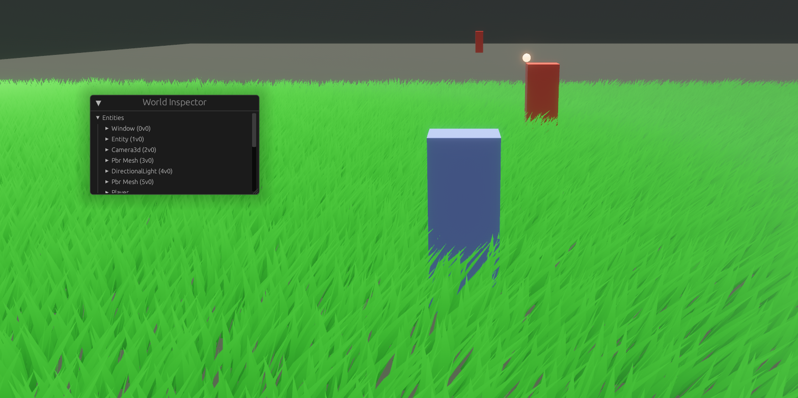

# My first game in Rust using Bevy

This project serves as a tech demo for various subjects / algorithms in game dev I'm interested in.  
It's also a way to hone my Rust outside of work.  
My interests are terrain generation, AI, pathfinding, etc.  

So far, I've been working on implementing grass with wind. I've gotten pretty far in two days.  

